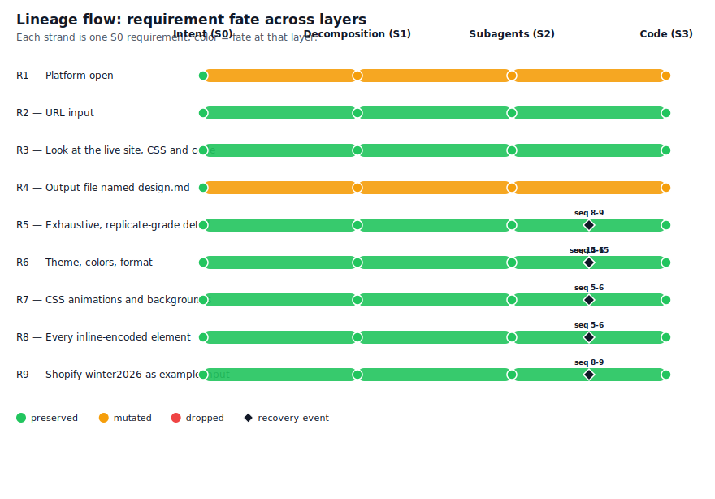
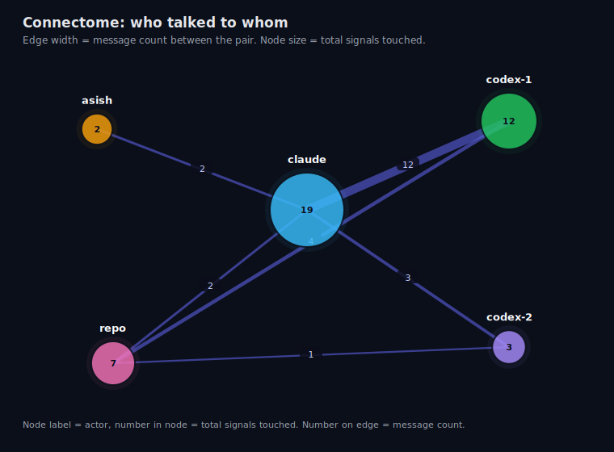
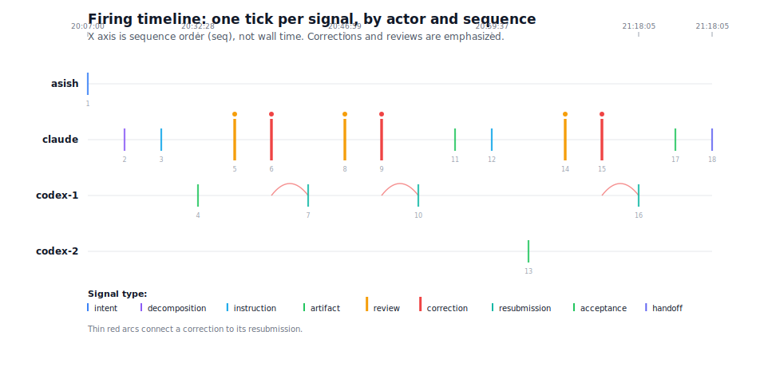
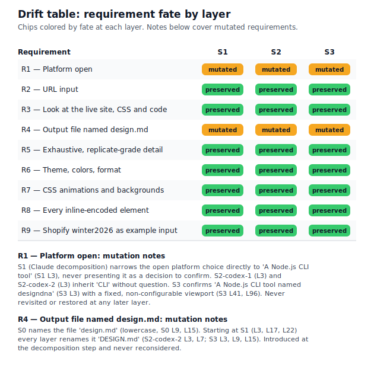

# The Telephone Game

**What happens to an instruction as it travels from a human, through an orchestrating AI, to coding subagents, and into code. A traced case study.**

A human asked for a tool in two sentences. A supervising model (Claude) decomposed the ask and directed two Codex subagents, which built it. Every message between the layers was logged, 18 signals with verbatim payloads, and afterwards each layer's understanding of the task was captured and compared by a neutral model.

**The finding.** 7 of the 9 original requirements survived every layer with their meaning intact. Both mutations happened at the first hop, where intent was translated into instructions, and neither was ever revisited. Meanwhile three implementation defects that the workers' own passing tests could not see were all caught by independent review one layer up.

**[Read the paper](paper/PAPER.md)** or **view the animated version on the study's web page** (link in the repository sidebar).

## The figures

Every arrow, tick, and strand below is generated by script from the real trace. Nothing is illustrative.

### Requirement lineage

Seven strands run straight and green. R1 (the platform choice) and R4 (the filename) turn amber at the first hop and stay amber.



### The connectome

Who talked to whom. Edge thickness is real message volume, the supervisor to worker 1 edge carried 12 of the 18 signals.



### The firing timeline

Every signal in sequence, reviews and corrections emphasized, arcs joining each correction to its resubmission.



### The drift table

Every requirement's fate at every layer.



## What was built along the way

The task inside the study is a real product, **designdna**, a CLI that takes a URL, renders it in headless Chromium, and writes an exhaustive machine readable DESIGN.md (colors, typography, layout, backgrounds, and every keyframe animation verbatim) detailed enough for an AI agent to replicate the design. It lives in [`build/designdna`](build/designdna) and works:

```
cd build/designdna
npm install && npx playwright install chromium
node bin/designdna.js https://www.shopify.com/editions/winter2026 -o DESIGN.md
```

A 2,671 line example output is at [`build/designdna/examples/DESIGN-shopify.md`](build/designdna/examples/DESIGN-shopify.md).

## Repository map

- `paper/PAPER.md` the writeup, `paper/SPEC.md` the pre registered protocol
- `trace/run-01.jsonl` the 18 signal log, `trace/payloads/` every message verbatim
- `trace/snapshots/` each layer's understanding, `trace/analysis/` the neutral drift classification
- `viz/render.py` generates all figures from the data (`python3 viz/render.py`)
- `site/` the animated web page (open `site/index.html` in a browser)
- `tools/trace.py` the append only trace logger
- `build/designdna` the product that was built

## Method in one paragraph

The trace logger recorded every signal as it happened (append only, validated). After the build, an identical six question form was answered from each layer's viewpoint using only what that layer received, the raw intent, the issued instructions, each worker's own instruction, and the final code read cold. A neutral model classified every original requirement at each layer as preserved, mutated, or dropped, and linked each correction signal to the requirement it protected. All prompts are published in `viz/prompts/` so the judgment can be re-run.
